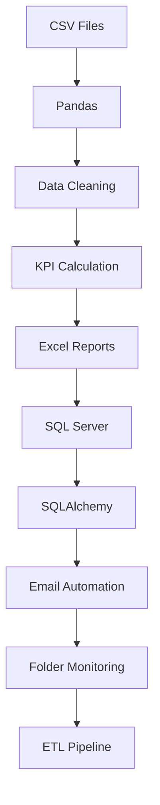

# 🛒 End-to-End Ecommerce Sales Automation Pipeline using Python

An end-to-end Python automation project that processes E-commerce sales data from CSV files, performs business analysis, generates Excel reports, integrates with SQL Server, automates email reporting, monitors folders in real time, and builds an ETL pipeline.

---

# 📌 Project Objective

This project demonstrates an end-to-end automation pipeline that replicates real-world Data Analyst workflows using Python. It automates data extraction, business analysis, reporting, SQL integration, email reporting, folder monitoring, logging, and ETL processing.

The automation pipeline covers:

- Reading CSV files
- Multi-file processing
- KPI reporting
- Excel automation
- SQL Server integration
- SQLAlchemy
- Email automation
- Windows Task Scheduler
- Folder automation
- Real-time folder monitoring
- Logging & Error Handling
- ETL Pipeline
  
---

# Table of Contents

- Project Objective
- Technologies Used
- Project Structure
- Automation Levels
- KPI Generated
- Workflow
- Screenshots
- Installation
- Future Enhancements
- Author
---
  Project Highlights

✔ 13 Automation Levels

✔ SQL Server Integration

✔ SQLAlchemy Integration

✔ Automated Excel Reporting

✔ Automated Outlook Emails

✔ Folder Monitoring

✔ Windows Task Scheduler

✔ Production Logging

✔ ETL Pipeline

✔ Real Business KPIs

---

# 🚀 Technologies Used

- Python
- Pandas
- SQL Server
- SQLAlchemy
- PyODBC
- OpenPyXL
- Watchdog
- Outlook Automation (pywin32)
- Windows Task Scheduler
---

# 📂 Project Structure

```
Ecommerce-Sales-Automation-Pipeline
│
├── data
├── docs
├── python_scripts
├── reports
├── screenshots
├── sql
├── .gitignore
├── LICENSE
├── README.md
└── requirements.txt
```

---

# ⚙️ Automation Levels

The project is built incrementally through 13 automation levels, where each level introduces a new automation concept commonly used in industry.

## ✅ Level 1
CSV Automation

- Read CSV
- DataFrame creation
- Basic business summary
- Excel report generation

---

## ✅ Level 2
Multi-File Automation

- Read multiple CSV files
- Merge into one master DataFrame
- Consolidated reporting

---

## ✅ Level 3
Business KPI Dashboard

- Total Orders
- Total Revenue
- Average Rating
- Average Order Value
- Top Revenue Product
- Top Revenue Category
- Top Revenue City
- Most Used Payment Method

---

## ✅ Level 4
Multi-Sheet Excel Reporting

Generated Excel workbook containing multiple business reports.

---

## ✅ Level 5
Timestamp Report Automation

Creates timestamped reports automatically.

Example:

```
Ecommerce_Report_20260626_185604.xlsx
```

---

## ✅ Level 6
SQL Server Automation

- Connect SQL Server
- Read data
- Export SQL results to Excel

---

## ✅ Level 7
Outlook Email Automation

Automatically

- Creates email
- Attaches report
- Sends report

---

## ✅ Level 8
Windows Task Scheduler

Automates report execution without manual intervention.

---

## ✅ Level 9
Folder Automation

Automatically processes every CSV inside a folder.

---

## ✅ Level 10
Real-Time Folder Monitoring

Detects newly added CSV files and updates reports automatically.

---

## ✅ Level 11
Logging & Error Handling

- Exception handling
- Automation logs
- Production-ready execution

---

## ✅ Level 12
SQLAlchemy Automation

Database connectivity using SQLAlchemy.

---

## ✅ Level 13
ETL Pipeline

Complete ETL Process

- Extract
- Transform
- Load

---

# 📊 Business KPIs Generated Automatically

- Total Orders
- Total Revenue
- Average Order Value
- Average Rating
- Total Quantity Sold
- Unique Products
- Unique Categories
- Unique Cities
- Top Revenue Product
- Top Revenue Category
- Top Revenue City
- Most Used Payment Method
- Highest Order Value
- Lowest Order Value

---

# 📈 Automation Workflow


---

# 📸 Project Screenshots

## Project Structure


---

## KPI Dashboard


---

## SQL Server Output


---

## Excel Report


---

## Folder Monitoring


---

## ETL Pipeline


---

# 💻 Installation

Clone Repository

```bash
git clone https://github.com/YOUR_USERNAME/Ecommerce-Sales-Automation-Pipeline.git
```

Install Required Packages

```bash
cd Ecommerce-Sales-Automation-Pipeline
```

```bash
pip install -r requirements.txt
```

Run Any Python Script

Example

```bash
python "python_scripts/Level 13 Ecom Real ETL Pipeline Automation.py"
```

---

# 📌 Future Enhancements

- Power BI Dashboard Integration
- Streamlit Dashboard
- Scheduled Cloud Execution
- REST API Integration
- Azure SQL Integration
- AWS S3 Integration
- Docker Deployment
- Power Automate Integration
- Interactive Power BI Dashboard
- Cloud ETL Scheduling

---

# 👨‍💻 Author

**Sujeet Jaiswal**

Drug Safety Associate | Aspiring Data Analyst

### Skills

- Python
- Pandas
- SQL
- SQL Server
- SQLAlchemy
- Excel Automation
- ETL
- Automation
- Power BI
---

# ⭐ If you found this project useful,

Please consider giving it a ⭐ on GitHub.
